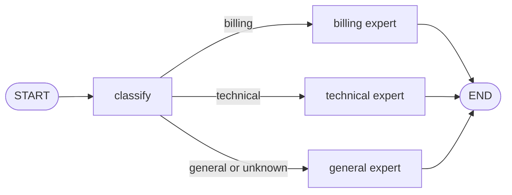

# 02: Router Pattern with Conditional Edges

Source: [02_router.py](../02_router.py)

## Purpose

This example chooses exactly one specialist for a request: billing, technical support, or general support. The local classifier is deliberately deterministic and replaceable by a model that produces a validated intent label.

## Graph Flow



## State and Node Walkthrough

`RouterState` starts with `query`. `classify_intent` case-folds the query, searches billing keywords first, then technical keywords, and otherwise writes `general` to `intent`. The order of those checks is meaningful if a query contains keywords from multiple groups: billing wins in this sample.

After the classifier has committed its state update, LangGraph calls `route_intent`. This edge function returns a route name only; it does not mutate state. The mapping passed to `add_conditional_edges` maps that name to the actual specialist node. Each specialist writes an `answer`, then its static edge terminates the run.

The router defaults to `general` if `intent` is missing or outside the known labels. The graph's classification node always writes an intent, but the fallback makes the routing function defensive when reused.

## Run and Test

```powershell
python patterns/02_router.py
python patterns/02_router.py --test
python -m unittest discover -s patterns -p "test_*.py" -v
```

The first command prompts for a support request and streams the node updates in execution order. You will see `classify` followed by exactly one of `billing`, `technical`, or `general`, then the selected intent and final response. The second command runs the embedded tests. Tests cover billing, technical, unknown, and empty queries.

## Persistence and Production Notes

The sample is stateless. Add a checkpointer if intent depends on earlier turns, and store relevant conversation history in graph state. For real model routing, constrain output to a small enum/schema and retain the general fallback for invalid or uncertain classifications. Use one routing mechanism per node: do not combine a conditional edge and a competing static outgoing edge from `classify`.