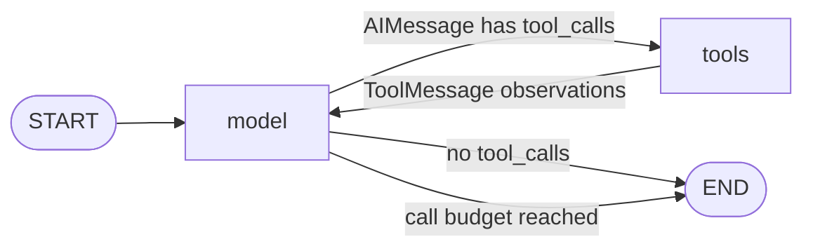

# 03: Agentic Tool Call Loop (ReAct)

Source: [03_react_loop.py](../03_react_loop.py)

## Purpose

The graph models the core tool-using agent cycle: request a model decision, execute requested tools, return observations to the conversation, and ask the model what to do next. A scripted local model reproduces provider-style `AIMessage` tool calls without API credentials.

## Graph Flow



## State and Node Walkthrough

`AgentState.messages` uses LangGraph's `add_messages` reducer. New assistant and tool messages are added to the conversation, and message IDs allow an update to replace a prior message instead of duplicating it. `llm_calls` tracks model-node calls; `max_llm_calls` provides a strict upper bound.

1. `model` invokes `ScriptedChatModel` with the current messages. The mock returns the next configured `AIMessage` and increments `llm_calls`.
2. `route_after_model` inspects only the latest message. Non-empty `tool_calls` routes to `tools`; an ordinary assistant response ends the graph.
3. `execute_tools` resolves each tool name against the explicit `TOOLS` registry, validates the integer arguments, executes the function, and returns one `ToolMessage` per call with the matching `tool_call_id`.
4. The static edge from `tools` loops back to `model`, which sees both the earlier assistant tool call and its new tool observation.
5. If another model call would exceed the configured budget, `call_model` emits a final stop message instead of invoking the model again.

Unknown tools and invalid arguments become error observations. This avoids arbitrary dynamic function execution and gives a real model an opportunity to recover. The tests assign unique assistant message IDs, reflecting real model response behavior with `add_messages`.

## Run and Test

```powershell
python patterns/03_react_loop.py
python patterns/03_react_loop.py --test
python -m unittest discover -s patterns -p "test_*.py" -v
```

The first command prompts for a request. The local demo understands addition and multiplication of exactly two integers, for example `Add 19 and 23` or `Multiply 6 by 7`. Supported requests print the model's tool request, the tool observation, and the model's final answer. Unsupported requests receive a direct response without a tool call. This is deterministic demonstration logic, not a general-purpose language model.

Use `--test` to run this script's embedded tests. They exercise the scripted add-tool round-trip, direct answer, unknown tool, call-budget stop condition, interactive-model tool round-trip, and unsupported request path.

## Persistence and Production Notes

Add a checkpointer and stable `thread_id` to preserve conversation state between invocations or recover interrupted work. This does not make external tool effects transactional: use idempotency keys, explicit timeouts/retries, auditing, and authorization checks for real tools. Keep model/tool loop bounds practical and validate tool input at the execution boundary even when using model structured output.