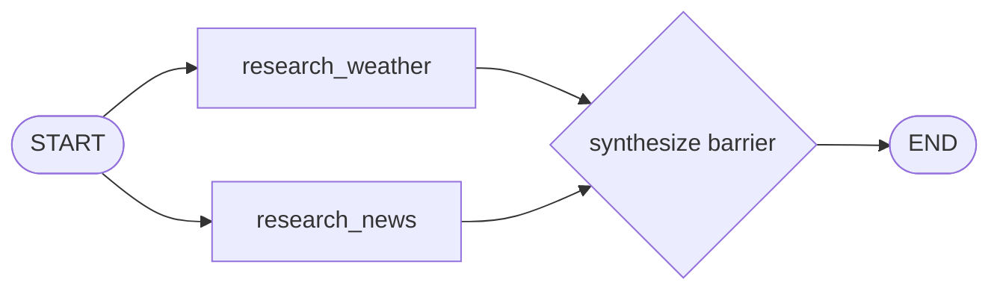

# 04: Parallel Execution (Fan-Out / Fan-In)

Source: [04_parallel.py](../04_parallel.py)

## Purpose

Independent research operations can run concurrently instead of waiting for one another. A fan-in barrier ensures synthesis sees every required branch result.

## Graph Flow



## State and Node Walkthrough

The shared `ResearchState` contains one input, `question`, and separate output fields for the weather and news branches. Distinct output fields are intentional: two parallel nodes writing the same ordinary state key can create a conflict unless a reducer handles those updates.

1. Both outgoing edges from `START` activate `research_weather` and `research_news` in the same graph superstep.
2. Each branch independently reads `question` and writes its own result field.
3. The list-form edge `add_edge(["research_weather", "research_news"], "synthesize")` acts as a join: it schedules `synthesize` after both named branches have completed.
4. `synthesize` combines the weather string and news list in a fixed presentation order and writes `briefing`.
5. The final edge terminates the graph.

LangGraph does not promise stable completion ordering for concurrent work. This example avoids depending on it because results use separate keys. When accumulating into one list, include stable indices and sort during fan-in.

## Run and Test

```powershell
python patterns/04_parallel.py
python -m unittest discover -s patterns -p "test_*.py" -v
```

The test checks that synthesis receives both branch results and includes both in the final briefing.

## Persistence and Production Notes

A checkpointer stores graph state at superstep boundaries. Successful work from a parallel step may be reused when recovering after another branch fails, but external reads should still be cached or safe to repeat. For IO-bound APIs, implement async nodes and invoke the graph asynchronously; set `max_concurrency` to respect provider limits.