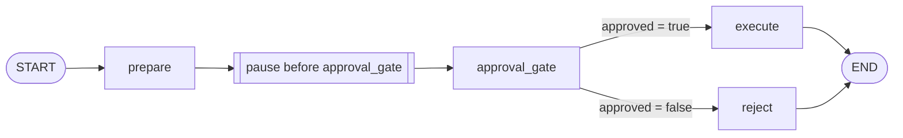

# 05: Human-in-the-Loop Approval

Source: [05_human_approval.py](../05_human_approval.py)

## Purpose

This example prevents a mock action from executing until a human decision has been written to checkpointed state. It demonstrates a compile-time `interrupt_before` breakpoint, which is useful for debugging and controlled review. It is not the preferred production UI mechanism; for dynamic approval payloads, use `interrupt()` and resume with `Command(resume=...)`.

## Graph Flow



## State and Node Walkthrough

`ApprovalState` contains the action, approval boolean, review proposal, and status. The initial input must provide every required key. `prepare_action` produces a displayable proposal and sets the status to `pending`; it does not execute the action.

1. The graph runs `prepare` and then pauses before `approval_gate` because of `interrupt_before=["approval_gate"]` in `compile()`.
2. The caller uses `get_state(config)` to inspect the pending snapshot and verifies that `snapshot.next` points to `approval_gate`.
3. A trusted reviewer decision is applied through `update_state(config, {"approved": ...})`.
4. `invoke(None, config)` resumes the same thread. The gate node runs, then `route_approval` returns exactly one destination.
5. `execute_action` writes an executed status only on the approved branch. Otherwise `reject_action` records rejection. Either path reaches `END`.

The test helper `run_review` performs those operations in sequence. The lower-level approval test explicitly inspects the paused state before changing it.

## Run and Test

```powershell
python patterns/05_human_approval.py
python -m unittest discover -s patterns -p "test_*.py" -v
```

Tests assert the pause location and proposal, then verify both approved and rejected outcomes.

## Persistence and Safety

The sample defaults to `InMemorySaver`; state disappears when the process exits. Production approval requires a durable checkpointer, stable thread ID, authenticated authorization for decision updates, and an audit log recording reviewer identity and decision. Avoid performing non-idempotent side effects before a dynamic interrupt because the node restarts from its beginning when resumed.