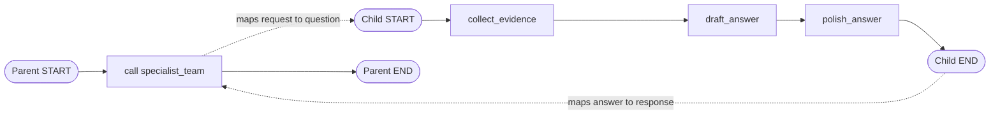

# 06: Subgraphs and Hierarchical Teams

Source: [06_subgraphs.py](../06_subgraphs.py)

## Purpose

Subgraphs package a multi-step specialist workflow behind a clear interface. This example uses different parent and child state schemas and explicitly maps values across their boundary.

## Graph Flow



## State and Node Walkthrough

`ParentState` exposes `request` and `response`. `SpecialistState` contains `question`, `evidence`, `draft`, and `answer`. Because schemas differ, `call_specialist` is a wrapper function: it creates the child input dictionary and returns only the child answer to the parent.

1. Parent node `specialist_team` receives `request`.
2. Its wrapper invokes a compiled specialist subgraph with `{"question": request}`.
3. In the child graph, `collect_evidence` writes mock evidence, `draft_answer` combines evidence and question, and `polish_answer` produces the final answer.
4. The wrapper copies `answer` into the parent `response` field. Child-only intermediate keys are not returned in parent output.
5. The parent graph reaches `END`.

`build_specialist()` can also be invoked independently, which makes the subgraph reusable and separately testable.

## Run and Test

```powershell
python patterns/06_subgraphs.py
python -m unittest discover -s patterns -p "test_*.py" -v
```

Tests check standalone child execution, successful parent invocation, and isolation of child-private fields.

## Persistence Modes

The parent graph accepts an optional checkpointer. The child in this example is invoked inside a normal wrapper call and has no independent checkpointer; its private state is per invocation and is not accumulated across separate calls. This is a suitable default for independent tasks. If the child needs its own per-thread conversational memory, compile it with `checkpointer=True`, pass appropriate invocation configuration, and avoid concurrent calls to the same stateful child thread. Use a compiled subgraph directly as a parent node when state keys are intentionally shared; use a wrapper when schemas differ or translation is required.