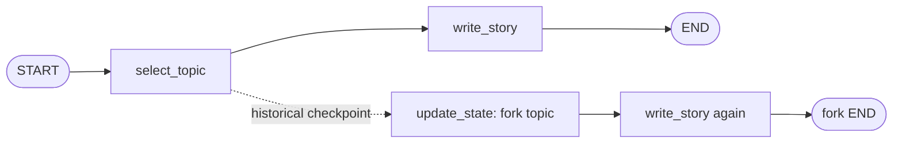

# 07: Time Travel and State Persistence

Source: [07_time_travel.py](../07_time_travel.py)

## Purpose

Checkpoint history enables inspection and replay. Forking from a past checkpoint lets an operator explore an alternate state without deleting the original run's history.

## Graph Flow



The dotted edge represents an external checkpoint operation, not a normal graph edge. The fork records a new checkpoint branch from the historical snapshot.

## State and Node Walkthrough

`StoryState` tracks `topic` and the optional generated `story`. `select_topic` trims and validates non-empty input. `write_story` deterministically formats the topic so the alternate branch is easy to compare.

1. Invoke the graph with a stable `thread_id`. Both graph nodes run and create checkpoint history.
2. `get_state_history(config)` yields snapshots in reverse chronological order. `fork_story` locates the snapshot whose `next` tuple is `("write_story",)`, i.e. after topic selection but before story generation.
3. `update_state` writes the alternate topic from that checkpoint and sets `as_node="select_topic"`. This marks the update as if it came from topic selection, so the next node is `write_story`.
4. `invoke(None, fork_config)` resumes the fork and regenerates the story using the new topic.
5. The original story's checkpoints remain in history alongside the new fork.

The helper returns the alternate branch result; it does not overwrite the original final state.

## Run and Test

```powershell
python patterns/07_time_travel.py
python -m unittest discover -s patterns -p "test_*.py" -v
```

Tests assert that history contains the pre-generation checkpoint, the fork changes the downstream result, both topics remain inspectable, and blank topics fail validation.

## Persistence and Replay Safety

`InMemorySaver` is convenient for examples but is volatile and process-local. Use a persistent saver such as PostgreSQL for production, protect thread IDs, configure retention, and plan schema migrations. Replay and fork re-execute downstream nodes; LLM calls and external requests may return different results or repeat side effects. Use idempotency keys or restrict replay to safe operations.