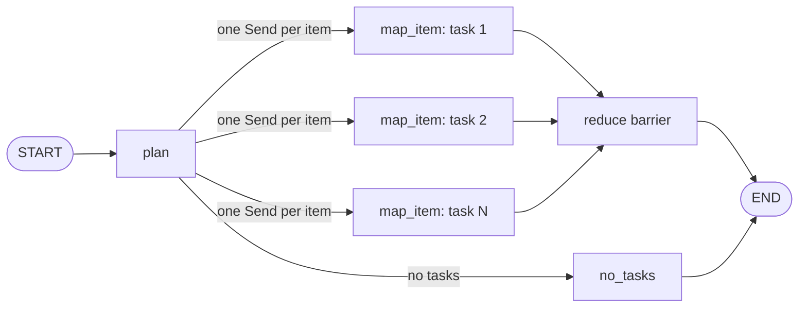

# 08: Dynamic Map-Reduce

Source: [08_map_reduce.py](../08_map_reduce.py)

## Purpose

Map-reduce is useful when a workflow must create a runtime-dependent number of independent tasks and combine their outputs after all workers complete. LangGraph's `Send` API makes each task a separate invocation of the same map node.

## Graph Flow



## State and Node Walkthrough

`OverallState` is the coordinator schema. `MapTask` is a narrower, per-worker payload containing one task's index and item. `results` uses `operator.add` so parallel workers can append their individual indexed results safely.

1. `plan_tasks` trims each input and removes empty strings. The number of resulting tasks is only known at runtime.
2. `dispatch_tasks` returns a `Send` for every normalized task. Each Send starts `map_item` with its own `MapTask` input, not a copy of the full coordinator state.
3. Each worker formats its item and returns `[(index, result)]` for the append reducer.
4. Once worker updates reach the `reduce` node, `reduce_results` sorts by index and joins the output. Sorting is necessary because completion/update order among parallel branches is not guaranteed.
5. If no tasks remain, the conditional edge routes directly to `no_tasks`, which sets an explicit empty-work summary. The reducer is not scheduled for an empty fan-out.

## Run and Test

```powershell
python patterns/08_map_reduce.py
python -m unittest discover -s patterns -p "test_*.py" -v
```

Tests validate variable fan-out, whitespace normalization, deterministic result order, and the empty-task path.

## Persistence and Production Notes

A checkpointer can preserve completed writes for recovery. Bound concurrency to the downstream service's capacity, keep Send payloads serializable, make each worker idempotent, and avoid storing large raw artifacts in graph state. For very large maps, store detailed outputs externally and checkpoint references or compact summaries.